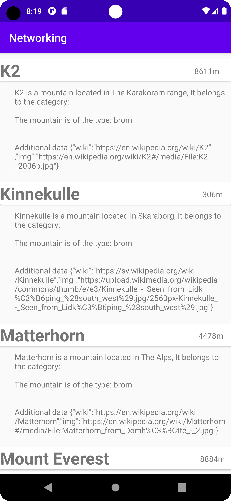

# Rapport

**Assignment 5: Networking**

Först skapades en RecyclerView. Denna kommer sedan att hålla all JSON-data som ska läsas in.
För att smidigt läsa in JSON-data skapades en klass ämnad att hålla denna informationen kallad
Mountain.java. För att följa de namnkonventioner fastställda inom JAVA användes @SerializedName.

Därefter skapades en RecyclerViewAdapter. Denna har som uppgift att tillhandahålla all funktionalitet
som erbjuds av RecyvlerView. Bland annat vilken data som ska visas samt hur många element som kan visas samtidigt osv.

För att skapa en design som gäller för varje element i Recyclerview skapades en Mountain_item.xml.
med en Constraintlayout samt en cardview. 

För att varje textView ska tillhandahållas rätt data länkades varje Textview i Mountain_Item.xml med sin motpart i Recyclerviewadapter på följande sätt.
```
public static class MyViewHolder extends RecyclerView.ViewHolder {
    TextView mountainName;
    TextView mountainHeight;
    TextView mountainDescription;
    public MyViewHolder(@NonNull View itemView) {
        super(itemView);

        mountainName = itemView.findViewById(R.id.textViewName);
        mountainHeight = itemView.findViewById(R.id.textViewHeight);
        mountainDescription = itemView.findViewById(R.id.textViewDesc);
    }
}
```
samt med följande kod för att specifiera vilken position/vilket element i Recyclerview vi vill använda.
```
public void onBindViewHolder(@NonNull RecyclerViewAdapter.MyViewHolder holder, int position) {
    holder.mountainName.setText(mountains.get(position).getName());
    holder.mountainHeight.setText(mountains.get(position).getSize() + "m");
    System.out.println(mountains.get(position).toString());
    holder.mountainDescription.setText(mountains.get(position).toString());
}
```
Till sist byttes JSON_FILE ut mot JSON_URL för att hämta data från Famouspeaks.json.

Resultatet av allt blev följande:
